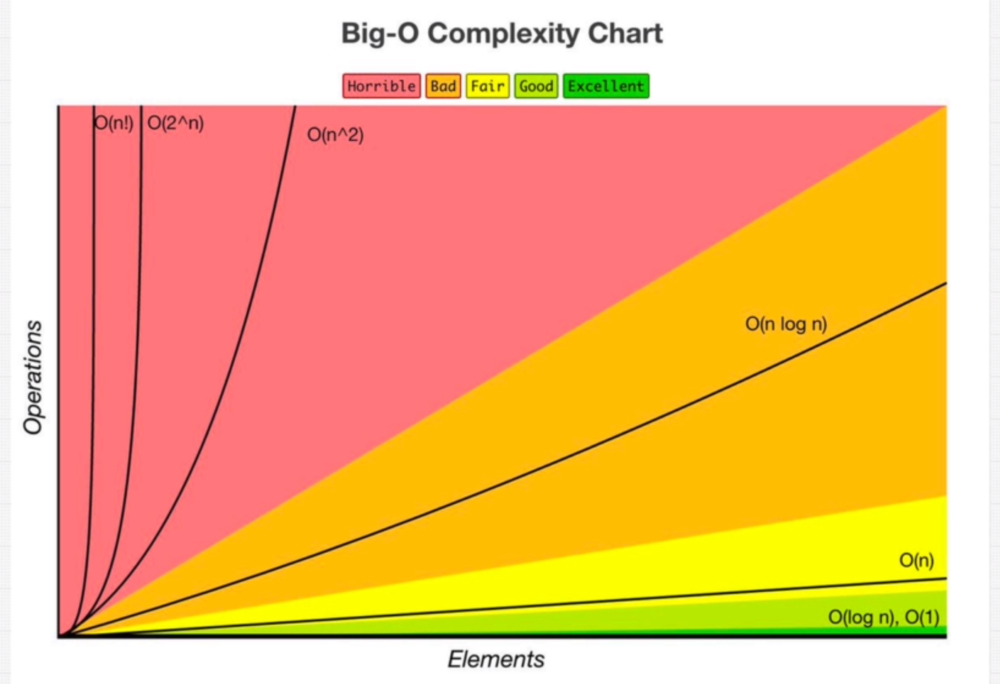

# What is good code?
1.	Readable
2.	Scalable in terms of
    *	Speed
    *	Memory

# Which Code is Best Can Be Answered with the 3 Pillars of Programming
1.	Readability
2.	Memory – Space Complexity
3.	Speed – Time Complexity

There is usually a tradeoff between memory and speed. If you want faster code, you may have to sacrifice more memory, and vice-versa.

# What is scalable code?
*	As the number of inputs increases, it doesn’t slow down more and more.
*	Big-O complexity: As the number of elements increases, how many more operations do we have to do?

 
# O(1): 
Constant- no loops. No matter how large the number of elements, we are always doing the same number of operations.
 
# O(log n): 
Logarithmic- usually searching algorithms have log n if they are sorted (Binary Search) 

# O(n): 
Linear- for loops, while loops through n items. As the number of elements increases, the number of operations increases proportionally.
 
# O(n log(n)): 
Log Linear- usually sorting operations 

# O(n^2): 
Quadratic- every element in a collection needs to be compared to every other element. Two nested loops. Every time the number of elements increases, the number of operations increases quadratically. In the example below, we have three operations, but when we increase the elements by one, the number of operations increases to nine. Note: if you ever have three nested loops of more (n^3 ) it is a bad idea and scales horribly.
 
# O(2^n): 
Exponential- recursive algorithms that solves a problem of size N 

# O(n!): 
Factorial- you are adding a loop for every element. You will not encounter this in real life because it is too expensive. You are adding a loop for every single element that you are iterating over!

# Calculating Big-O: Rule Book
1.	Worst Case – Always assume the worst-case scenario.
2.	Remove Constants – You remove the constants because they don’t really make a difference when you are thinking in terms of the worst-case scenario.
    *	Ex1: O(n/2 + 101)  becomes -> O(n)
    *	Ex2: O(2n) becomes -> O(n)
3.	Different Terms for Inputs
    *	Ex1: If you have a function that takes two inputs and inside that function you loop through each input, the Big-O looks like this -> O(a + b)
    *	If steps are indented (ex. Nested loops) we use multiplication notation, but if the steps happen in the same indentation, we use addition notation.
4.	Drop Non-Dominants – We only care about the most important term and we drop the others. We want to simplify by getting rid of the insignificant items.
    *	Ex1: if we have a piece of code with the following big-o complexity, O(n + n^2), we drop the n because it is the non-dominant. When we think of scalability, n^2 is much more important to us than n.

# What Causes Time in a Function?
  *	Operations (+, -, *, /)
  *	Comparisons (<, >, ===)
  *	Looping (for, while)
  *	Outside Function calls ( function() )
# Space Complexity
When a program executes, it has two ways to remember things:
  *	Heap – usually where we store variables 
  *	Stack – usually where we keep track of our function calls

# What Causes Space Complexity?
  *	Variables
  *	Data Structures
  *	Function Calls
  *	Allocations
