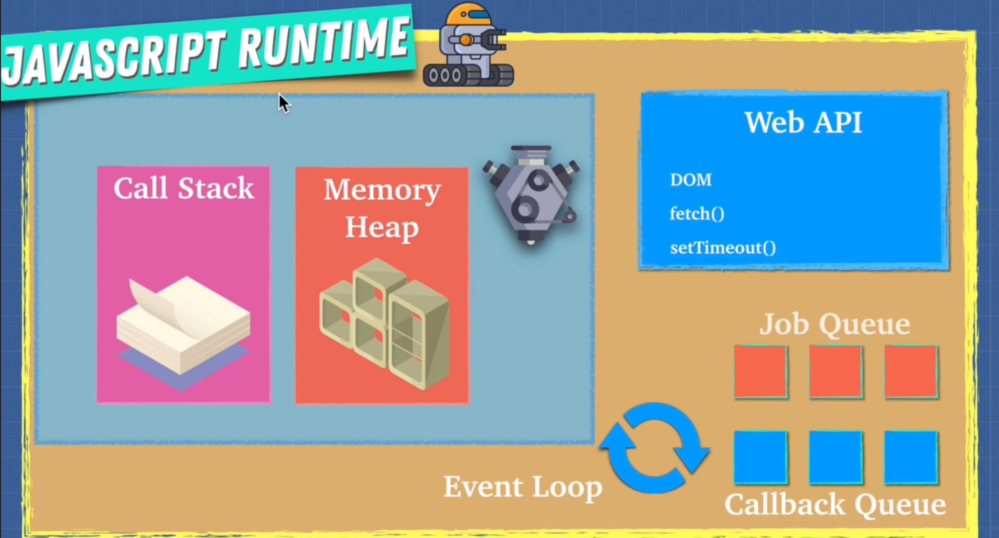

# How JavaScript Works
A program has to allocate memory and it has to parse and execute scripts. The JavaScript engine has two parts, the memory heap and the call stack. 
* The memory heap is where we allocate memory. When we create a variable in our code this is where is it allocated to memory. It's important to remember that memory is limited. If we run out of memory we get what is called a memory leak. 
* The call stack is where we read and execute code. When a function runs it gets pushed onto the call stack where it is read and executed. Functions go onto the call stack on a first-in-last-out basis.

## Explain: JavaScript is a single threaded language that can be non-blocking.
Single threaded means that it has only one call stack. Which means you can only do one thing at a time and we have to wait for one thing to finish to move on to the next. This is called Synchronous programming. Other languages can be multi-threaded and have more than one stack to do different things at one time. 

In a single threaded language, if we have something that takes a lot of time to complete if can slow everything down. This is where asynchronous programming comes in.

In order for JavaScript to run we need more than just the JavaScript Engine, we need a JavaScript Run-Time Environment. The Run-Time Environment includes the JavaScript engine, Web API's, the Event Loop, and the Callback Queue.

JavaScript can be Asynchronous with callback functions. When a function is pushed onto the stack, the engine recognizes if it is a Web API (DOM, AJAX, Timeout, etc.). If it is, the function is sent to the Web API, the Web API runs it, which triggers the callback function inside. When the callback function returns, it is sent to the callback queue. It waits there until the call stack has cleared. The event loop then pushes it back onto the call stack. While all this is happening, the rest of the items on the call stack are running. They don't have to wait for the callback function. 

# Promises
A promise is an object that may produce a single value some time in the future. Either a resovled value, or a reason that it's not resolved (rejected). Promises are great for asynchronous programming, like when you want to do API calls, grab data from a database, etc.

A promise may be in one of three possible states:
* fulfilled
* rejected
* pending

```js

const promise = new Promise((resolve, reject) => {
  if (true) {
    resolve('stuff worked');
  } else {
    reject('error, it broke!');
  }
})

// when the promise resolves it will send 'stuff worked' to result below
promise
  .then(result => `${result}!!!`)
  // this is called chaining. We can send the result to the next 'then'
  .then(result2 => { console.log(result2); 
  })
  // 'catch' catches errors that occur ABOVE it. If we placed the 'catch' statment between the two 'then' statement, only an error in the first 'then' statement would be caught. 
  .catch(() => console.log('error!!!'))
```

## Promise.all()
Promise.all takes in an array of promises and returns the resolve if all the promises in the array are resolved.
```js
Promise.all([promise, promise2, promise3])
  // the values of each promise are returned in an array in the order in which they ran.
  .then(values => {
    console.log(values);
  })

```

# Async Await
Async Await is part of ES8 and is built on top of Promises. Async Await makes code easier to read.

```js
// fetch is a Promise. Here we make an API call to get all the users from somewhere. 
fetch('http://someApiUrl/users')
  .then(resp => resp.json())
  .then(console.log(resp))

// we can rewrite the same fetch with Async Await. // first we declare a function as async. It let's JS know that this function will return a promise
async function fetchUsers() {
  // with an async function we have access to the 'await' keyword. Here, the 'await' keyword pauses the fetchUsers function execution until fetch resolves and returns a value. That value is then stored in the resp variable.
  const resp = await fetch('http://someApiUrl/users');
  // we pause execution again until resp.json() resolves and then store that value in data.
  const data = await resp.json();
  // and finally we can log data.
  console.log(data);
}
```

## But what about catch!?
With Async Await we have to use try-catch blocks to catch errors
```js
async function fetchUsers() {
  try{
    const resp = await fetch('http://someApiUrl/users');
    const data = await resp.json();
    console.log(data);

    // if anything fails within the try block, we catch it here
  } catch (err) {
    console.log(err)
  }
}
```

# Job Queue
With ES6 the Job Queue was introduced to accomodate Promises because they are not a part of the Web API, they are JavaScript. The Job Queue is smaller than the Callback Queue, but it has priority over the Callback Queue.

```js
// When setTimeout runs, it is pushed onto the Call Stack. The engine recognizes that it is a Web API, pops it off the stack, and sends it to the Web API. The Web API executes setTimeout and sends the callback function to the Callback Queue. Meanwhile, we have moved onto the next line.
setTimeout(()=>{ console.log('hello') }, 10)
// Now, Promise runs and is pushed onto the callstack. The engine recognizes that it's a Promise, pops it off the stack and sends it to the job queue. Once the Promise resolves it returns console.log. Meanwhile, we have moved onto the next line. 
Promise.resolve('hi').then((data) => console.log(data))
// Now, the console.log function runs and is pushed onto the callstack. There are no other functions to run and it is not a Web API or a Promise, so, console.log is executed and poppoed off the call stack. 
console.log('aloha!');

// Now the event loop looks at the Job Queue first since it has priority over the Callback Queue. It pushed the first item, in this case the resolved promise onto the callstack and it executes.

// Once the Job Queue is empty, the event loop looks at the Callback Queue and pushes the next item onto the Callstack and executes until the Callback Queue is empty.

// The results of the above code look like this:

// aloha!
// hi
// hello


// NOTE: this might not always work as expected, because some legacy browsers might not have the job queue
```



# Parallel, Sequence, Race


# Threads, Concurrency, Parallelism