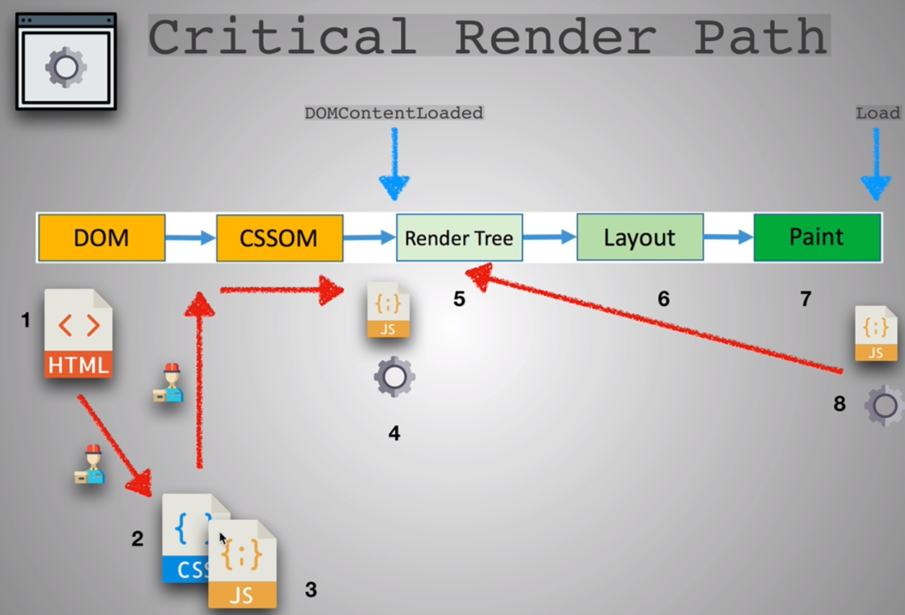
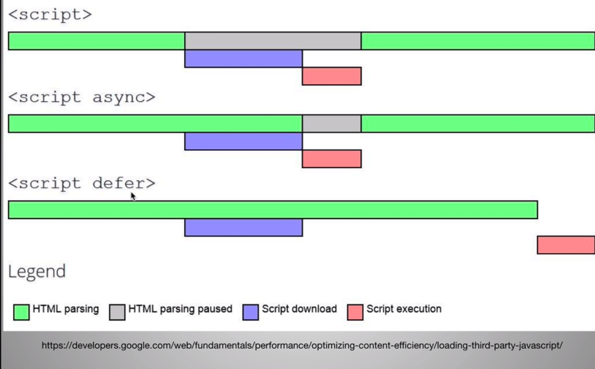

# Introductions

In most companies, web performance is a priority. Users do not like waiting for pages to load, but the Internet speeds among users can vary drastically.

User's expect a site to load in about 2 seconds, and most users will leave if it takes longer than 3 seconds. Each second of delay increases customer dissatisfaction and can costs a lot of money in lost sales, ad revenue, etc.

# 3 Keys to Performance

- Client Side Page Rendering -
- Network Latency -
- Backend Processing -

# Network Performance

To view a web page, your browser must download all of the related files from the web browser. The more kilobytes we need to download, the longer it takes to view the website.

How can we decrease the size of the data we need to download?

- Minimize text (HTML, CSS, and JS files)
  - Webpack
  - Uglify.js
- Minimize images
  - use the right image size at the right time.
  - you can also blur images to reduce the details in the image, thus reducing the size. (this technique works well for background images.)

# Image File Formats

- svg
  - vector graphics
  - keeps sharpness when enlarged
  - small file sizes
  - can be customized with css
  - usually simplistic images
- jpg
  - usually used for complex images and things with lots of color
  - does not allow transparency
- gif
- png
  - limit the number of colors
  - allows transparency

# Image Optimizations

- if you want transparency: Use PNG
- if you want animations: Use Gif
- if you want colorful images: use JPG
- if you want simple icons, logos, and illustrations: use SVG
- reduce PNG with TinyPNG
  - www.tinypng.com
  - photoshop has a tool as well
- reduce JPG with JPEG-optimizer
  - www.jpeg-optimizer.com
  - photoshop has a tool as well
- try to choose simple illuestrations over over highly detailed photographs
- always lower JPEG image quality 30-60%
- resize image based on size it will be displayed
- display different sized images for different backgrounds
  - CSS media queries
- use CDN's like imigx
  - www.imigix.com
- remove image metadata
  - www.verexif.com
  - photoshop has a tool as well

# Critical Render Path



- Once the HTML arrives to the browser, the browser starts parsing the html file and building the DOM. When the browser encounters external files (CSS, JS, img, etc) it begins downloading them. note: image files are downloaded in the background and are loaded once they are finished.
- When the browser receives the CSS file(s) it begins building the CSS OM (CSS Object Model).
- If the browser encounters a JS file it will make any changes it needs to make to the DOM and the CSS OM.
- Then it continues building the DOM and CSS OM.
- Once it is finished, it combines the DOM and CSS OM, creating the Render Tree.
- The browser uses the render tree to figure out the layout of the page.
- Finally, the page is painted on the screen.

## How do we optimize the critical render path?

HTML

- load CSS files as soon as possible. Load style tage in the <head>
- load JS files as late as possible, with a few exceptions here and there (ie. google analytics). Load scripts right before </body>
  - Why? Because JS blocks page rendering and it may require HTML and CSS to run.

CSS

- Only load whatever is needed
  - we can also use inline css or internal styling tags on the html file. This is a good trick for anything above the fold, but not for the whole page.
- Above the fold loading - Once the page loads, we can use JS to load the stylesheets for the content that is below the fold.

```html
<script type="text/javascript">
  const loadStylesheet = src => {
    if (document.createStylesheet) {
      document.createStylesheet(src);
    } else {
      const stylesheet = document.createElement("link");
      stylesheet.href = src;
      stylesheet.type = "text/css";
      stylesheet.type = "stylesheet";
      document.getElementsByTagName("head")[0].appendChild(stylesheet);
    }
  };

  window.onload = function() {
    console.log("window done!");
    loadStyleSheet("url.css");
  };
</script>
```

- Media attributes - download in the background and not disrupt the page load if screen does not match

```html
<link
  rel="stylesheet"
  href="url.css"
  media="only screen and (min-width:500px)"
/>
```

- Less Specificity - the browser needs to calculate the styling. The more complex it is, the longer it will take.

```css
/* BAD */
.header .nav .item .link a.important {
  color: pink;
}

/* GOOD */
a.important {
  color: pink;
}
```

JavaScript

- Load scripts asynchronously
- Defer loading of scripts
- Minimize DOM manipulation
- Avoid long running JavaScript - results in blocking and bad user experience



- < script >
  - use for critical scripts
- < script async >

  - add to anything that doesnt affect the DOM or CSS OM. Basically, anything that doesn't require knowledge of our code and won't affect user experience. 3rd party scripts.

- < script defer >
  - use for 3rd party scripts, script that are not too important and are not above the fold.

# HTTP/2

# Performance Tools

Google's Page Speed Insights

https://developers.google.com/speed/pagespeed/insights/

WebPage Tester

https://www.webpagetest.org/

JPG Optimizer

www.jpeg-optimizer.com

TINY PNG

www.tinypng.com

XNConvert: This free, cross-platform tool can handle batched images, and performs resizing, optimization, and other transforms.

https://www.xnview.com/en/xnconvert/

ImageOptim: This free tool is available for Mac and as an online service, and is specifically aimed at optimizing images for speed, including metadata removal (discussed above).

https://imageoptim.com/mac

ResizeIt: A Mac-only desktop product that lets you change the size of multiple images simultaneously, and can convert file formats at the same time.

PicResize: One of several good browser-based tools that gives you lots of options for cropping, rotating, resizing, adding effects to, and converting images.

http://www.picresize.com/

Gimp: This ever-popular cross-platform tool just gets better with age. Powerful and flexible, Gimp lets you perform a wide variety of image manipulation tasks including, of course, resizing.

https://www.gimp.org/

## CHROME DEV TOOLS

View main thread activities in a table to sort activities based on which ones took up the most time.

https://developers.google.com/web/tools/chrome-devtools/evaluate-performance/reference#activities

Analyze frames per second (FPS) to measure whether your animations truly run smoothly.

https://developers.google.com/web/tools/chrome-devtools/evaluate-performance/reference#fps

Monitor CPU usage, JS heap size, DOM nodes, layouts per second, and more in real-time with the Performance Monitor.

https://developers.google.com/web/updates/2017/11/devtools-release-notes#perf-monitor

Capture screenshots while recording to play back exactly how the page looked while the page loaded, or an animation fired, and so on.

https://developers.google.com/web/tools/chrome-devtools/evaluate-performance/reference#screenshots

View interactions to quickly identify what happened on a page after a user interacted with it.

https://developers.google.com/web/tools/chrome-devtools/evaluate-performance/reference#interactions

Find scroll performance issues in real-time by highlighting the page whenever a potentially problematic listener fires.

https://developers.google.com/web/tools/chrome-devtools/evaluate-performance/reference#scrolling-performance-issues

View paint events in real-time to identify costly paint events that may be harming the performance of your animations.

https://developers.google.com/web/tools/chrome-devtools/evaluate-performance/reference#paint-flashing

View main thread activity to view every event that occurred on the main thread while you were recording.

https://developers.google.com/web/tools/chrome-devtools/evaluate-performance/reference#main

## OTHER RESOURCES

http://optimizilla.com/

https://tools.pingdom.com/

https://www.thinkwithgoogle.com/feature/mobile/

https://developers.google.com/web/tools/lighthouse/

http://websitespeedranker.com/

https://pageweight.imgix.com/

https://developers.google.com/speed/pagespeed/insights/

https://passmarked.com/

https://images.guide/

https://www.crazyegg.com/blog/image-editing-tools/
